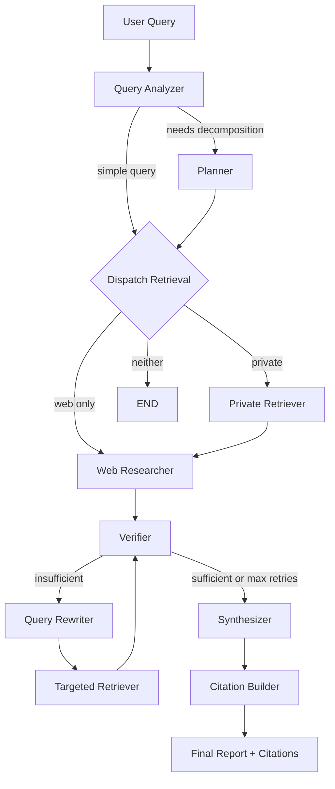

# DeepResearch-RAG

An agentic research assistant, not another PDF chatbot. Give it a complex question and it plans out how to research it, pulls evidence from your documents and the live web, checks whether that evidence actually supports an answer before writing one, and cites every claim back to a real source.

## Why this exists

Most RAG demos retrieve a handful of chunks and generate an answer in one pass. That's fine for simple lookups, but it falls apart the moment a question has multiple parts or the retrieved evidence is weak — the model just answers anyway, confidently, often wrong. This project builds the missing pieces: query decomposition, hybrid retrieval, reranking, a verification step that can say "not enough evidence" and trigger a retry, and a citation system that can't fabricate a source even if it tried.

## What it does

- Ingests PDF, DOCX, Markdown, HTML, and TXT files, with structure-aware chunking that keeps page and section metadata intact
- Retrieves using both dense (pgvector) and sparse (BM25) search, fused with Reciprocal Rank Fusion, then reranked with a cross-encoder
- Runs the whole thing through a LangGraph pipeline: analyze the query, decompose it if needed, retrieve from private docs and the web in parallel, verify the evidence, rewrite and retry if it's not good enough (bounded, so it can't loop forever), then synthesize and cite
- Produces citations that are structurally incapable of being made up — the model can only point to a numbered piece of evidence the system already retrieved, never invent a source from thin air
- Ships with a real evaluation setup: Recall@K, MRR, and NDCG computed directly (no black-box library), plus LLM-judged faithfulness and relevancy, across five different pipeline configurations
- Handles document processing asynchronously through Celery, with a job ID you can poll
- Comes with a small, dependency-free frontend — one HTML file, no build step

## How the pipeline works



Each node does one job and only talks to the others through a single shared state object:

| Node | Job |
|---|---|
| `query_analyzer` | Figures out what kind of question this is and what it needs |
| `planner` | Breaks a complex question into independent sub-questions |
| `private_retriever` | Hybrid search + reranking against your uploaded documents |
| `web_researcher` | Live search via Tavily |
| `verifier` | Checks, per sub-question, whether the evidence is actually good enough |
| `query_rewriter` | Reformulates a sub-question that failed verification, capped by `MAX_RETRIES` |
| `synthesizer` | Writes claims, each one tied to a specific piece of evidence by index |
| `citation_builder` | Turns those indices into real citations — no LLM involved at this step, on purpose |

## Why hybrid retrieval and reranking

Dense embeddings are good at catching paraphrases and semantic similarity but can miss exact or rare terms — a specific product name, an error code, a serial number. BM25 catches those but misses meaning. Fusing both with RRF means neither weakness dominates. Reranking sits on top of that: a cross-encoder that reads the query and each candidate together scores relevance far more precisely than cosine similarity alone, but it's too slow to run over an entire corpus, so it only touches the shortlist that hybrid search already narrowed down.

## The corrective loop

```
Retrieve → Verify each sub-question → good enough?
  → yes: write the answer
  → no: rewrite the question → retrieve again (just for the failing parts) → verify again
        (hard stop at MAX_RETRIES, no matter what)
```

This isn't theoretical — I tested it live with a question about "GPT-5" specifically, and the system correctly refused to answer after exhausting its retries, because the web results it found were all about GPT-5.4 and later point releases, not the actual GPT-5 announcement. A naive RAG setup would've blended those together and likely gotten the details wrong. This one said, in effect, "I don't have enough to answer this precisely," which is exactly the behavior you want.

## Citations that can't lie

The synthesizer doesn't get to name its sources directly — it can only reference evidence by a number pointing into a list the backend built and controls. The citation builder then does a plain dictionary lookup from that number to the real chunk or URL. There's no LLM call in that final step at all, which means there's no code path where a citation could be invented.

## Evaluation

I originally planned to use RAGAS for this, but it turned out to be more trouble than it was worth — two different versions had dependency conflicts that would've forced an untested, potentially breaking upgrade to the whole LangChain/LangGraph stack this project runs on. Rather than fight that, I built the metrics directly: Recall@K, MRR, and NDCG from scratch (they're not complicated), plus faithfulness and relevancy scored by the same LLM already powering the pipeline. Results across five pipeline variants (plain vector search, hybrid, hybrid with reranking, agentic without correction, and the full corrective loop) live in `data/evaluation/results/` — actual numbers from actual runs, not estimates.

One honest caveat: the current eval set is small and each question maps cleanly to one document, so every variant scores close to perfect. It doesn't yet show hybrid or reranking pulling ahead the way they should on harder, more ambiguous questions. That's a known gap, not a hidden one — see Limitations below.

## Stack

FastAPI, PostgreSQL with pgvector, SQLAlchemy (async), Redis, Celery, LangGraph, LangChain, Groq (`openai/gpt-oss-120b`), Tavily, `sentence-transformers` (BAAI/bge-small-en-v1.5 for embeddings, BAAI/bge-reranker-base for reranking), `rank_bm25`, Docker Compose, pytest.

## Project layout

```
app/
  agents/       LangGraph nodes, shared state, graph wiring
  api/routes/    FastAPI endpoints
  core/          config, logging, exceptions, observability
  database/      models, repository, connection
  evaluation/    metrics, eval dataset, pipeline variant runners
  ingestion/     document loading, cleaning, chunking
  llm/           provider abstraction, prompts, structured outputs
  retrieval/     embeddings, vector search, BM25, hybrid fusion, reranker
  services/      web search
  workers/       Celery app and tasks
  schemas/       request/response models
tests/
  unit/          fast tests, no external calls — this is the default `pytest` run
  integration/   touches the database, still no LLM calls
  (both also contain @pytest.mark.e2e tests that make real Groq/Tavily calls — run with `pytest -m e2e`)
frontend/        one HTML file, the whole UI
scripts/         eval corpus setup
data/            uploads and evaluation results
docker/          Dockerfile
```

## Getting it running

```powershell
python -m venv .venv
.venv\Scripts\Activate.ps1
pip install -r requirements.txt
pip install torch --index-url https://download.pytorch.org/whl/cpu
cp .env.example .env
```

Fill in `GROQ_API_KEY` and `TAVILY_API_KEY` in `.env` before doing anything else — both are free to get, and the app won't run without them.

Then, locally without Docker:

```powershell
docker compose up -d postgres redis
# apply the migration once — see DEPLOYMENT.md
uvicorn app.main:app
celery -A app.workers.celery_app worker --loglevel=info --pool=solo
```

Open `frontend/index.html` in a browser. That's the whole UI, no build step.

Or the whole thing in Docker:

```powershell
docker compose up --build
```

See `DEPLOYMENT.md` for the migration step and notes on deploying somewhere other than your laptop.

## Try asking it

- "What is a dropout layer?" — simple, web-sourced, comes back with several distinct claims and real citations
- "Compare AWS, GCP, and Azure for GPU-based ML inference, considering cost and scalability" — this one gets decomposed into roughly nine sub-questions, one per provider/criterion pair
- "According to my documents, what is the boiling point of water?" — upload a text file first; this tests retrieval against your own content specifically

## What's actually true about performance

Whatever numbers are in `data/evaluation/results/` — that's it, that's the real performance data. I'm not going to write claims here that aren't backed by a file you can open and check yourself.

## Where it falls short

Being upfront about these rather than burying them:

- **RAGAS didn't work out.** Tried two versions, both had version conflicts with the LangChain stack this whole project depends on. Built the metrics by hand instead.
- **The eval set is too easy right now.** Every question maps to exactly one obvious document, so every pipeline variant scores near-perfect. It needs harder, more ambiguous questions and some distractor documents before the numbers mean much.
- **Groq's free tier has a token-per-minute ceiling** that becomes a real constraint once you're running the full test suite or an evaluation pass. I split the tests into a fast default tier and an opt-in `e2e` tier partly because of this.
- **Web search has a recency bias.** A question about "GPT-5" specifically pulled back results dominated by newer point releases (5.4, 5.5, 5.6) instead of the original announcement — the system correctly declined to answer rather than guess, but it's a real limitation of leaning on live web search.
- **No authentication.** Don't put this in front of real users without adding one.
- **Source routing is query-level, not sub-question-level.** If a query needs both private and web search, every sub-question goes through both, even the ones that clearly only need one. Some retrieval noise as a result — noted, not yet fixed.
- **BM25's index lives in memory, per process.** Fine at this scale. Wouldn't hold up across multiple worker processes without a shared search backend.

## What I'd build next

- A harder evaluation set with real distractor documents
- Sub-question-level source routing instead of query-level
- Persisting research sessions instead of treating each `/research` call as stateless
- The fuller structured report format from the original spec — executive summary, key findings, a recommendation section
- Auth

## License

MIT
